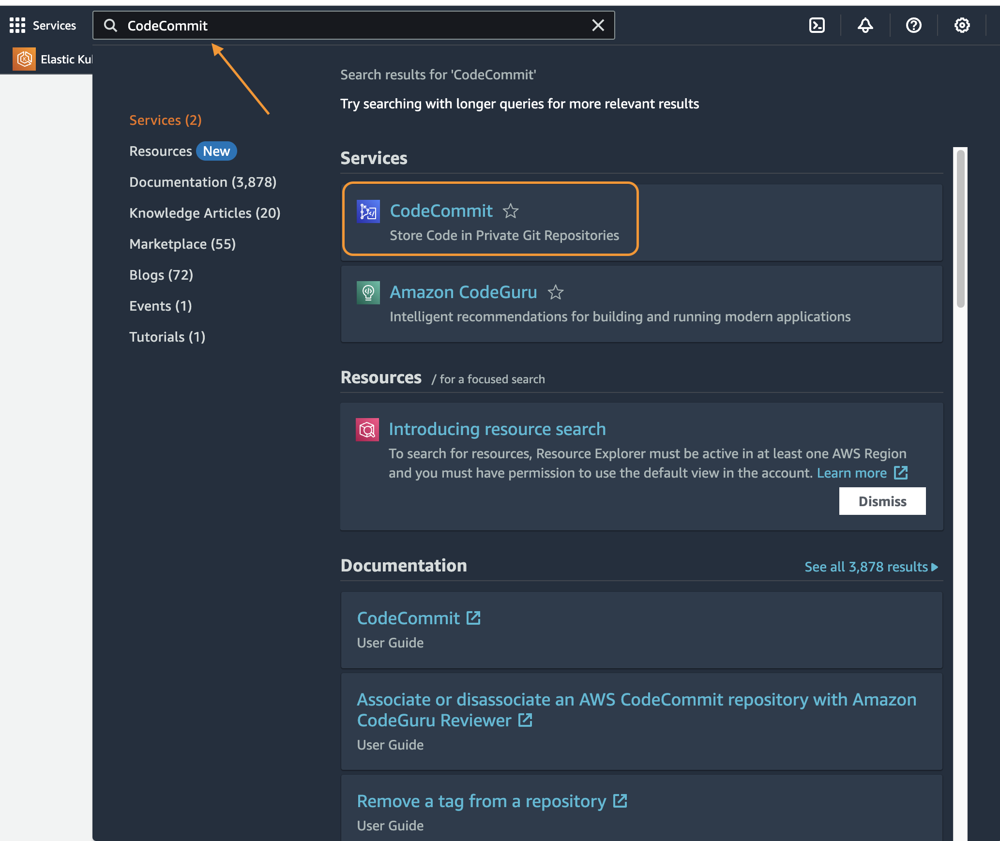
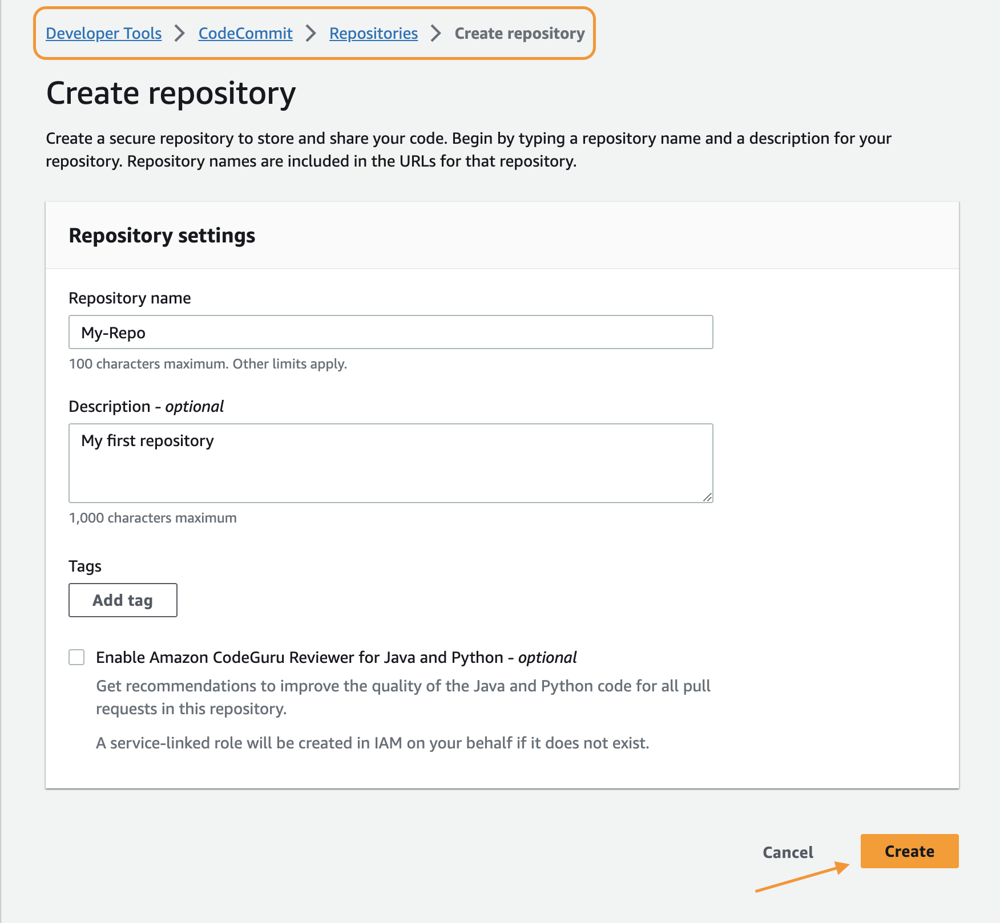
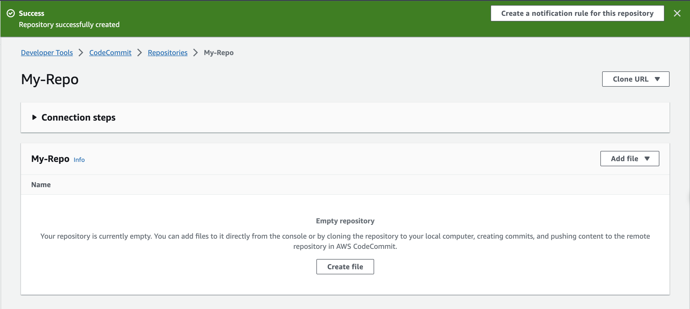
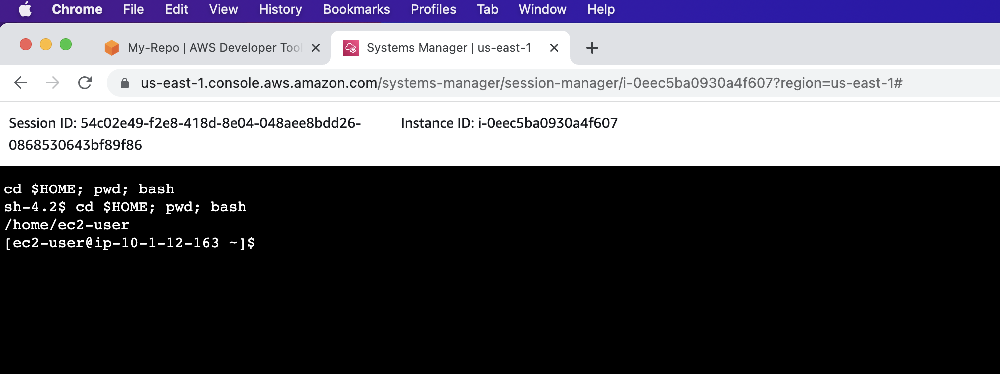
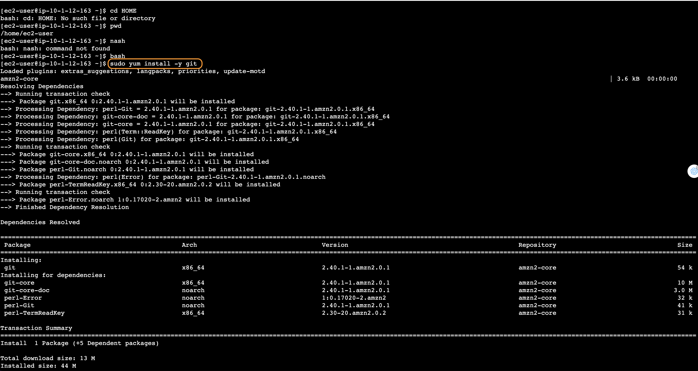
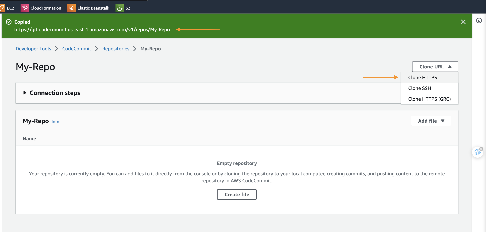

# Working with AWS CodeCommit
## **Overview**

AWS CodeCommit is a highly scalable, managed source control service that hosts private Git repositories. CodeCommit stores your data in Amazon S3 and Amazon DynamoDB giving your repositories high scalability, availability, and durability. You simply create a repository to store your code. There is no hardware to provision and scale or software to install, configure, and operate.

This hands-on lab gives you practice with AWS CodeCommit, part of AWS Developer Tools. In this lab, you first create a code repository in AWS CodeCommit. Then you create a local repository on a Linux instance running in EC2. After you create the local repo, you make some changes to it. Then you synchronize (commit) your changes to the AWS CodeCommit repository.

## **Task 1: Create an AWS CodeCommit repository**

In this task, you use the AWS Management Console to create an AWS CodeCommit repository.

1. At the top of the AWS Management Console, in the search bar, search for and choose `CodeCommit` 



1. On the **AWS CodeCommit** page, choose **Create repository**.
2. On the **Create repository** page:
- For **Repository name**, enter: `My-Repo`
- For **Description** enter: `My first repository`
1. Choose **Create**.
    
    
    

An empty repository named *My-Repo* is created.

You should now be on the **My-Repo** page, which contains the details to connect to the repository.



Congratulations! You have successfully created a new CodeCommit repository.

## **Task 2: Connect to the Amazon EC2 instance**

An Amazon EC2 instance has been created for you as part of the lab environment build process. In this task, you connect to the instance using AWS Systems Manager Session Manager. 

Copy the **`Ec2InstanceSessionUrl`** value from the list to the left of these instructions, and then paste it into a new web browser tab.



A console connection is made to the instance inside your web browser window. A set of commands are run automatically when you connect to the instance that change to the user’s home directory and display the path of the working directory, similar to this:

```bash
cd HOME; pwd; bash
sh-4.2$ cd HOME; bash; pwd
/home/ec2-user
[ec2-user@ip-10-0-1-137 ~]$
```

Congratulations! You have successfully connected to a terminal session on the lab EC2 instance.

## **Task 3: Create a local repository using Git**

This task provides an example of how you would use AWS CodeCommit to synchronize to any local code repository that you might create in your normal production development environment.

- In the terminal session, run the following command to install the Git client:

```bash
sudo yum install -y git
```



On a Windows-based computer, you might need to use **Ctrl + Shift + V** or open the context menu (right-click) to paste text into a Session Manager console window.

- Run the following commands to configure the Git credential helper with the AWS credential profile, and allow the Git credential helper to send the path to repositories:

```bash
git config --global credential.helper '!aws codecommit credential-helper $@'
git config --global credential.UseHttpPath true
```

These commands have no output.


Next, obtain the HTTPS URL of your AWS CodeCommit repository.

- Return to your web browser tab with the AWS CodeCommit console, which should be on the **My-Repo** page.
- At the upper-right of the page, choose **Clone URL** , and then choose **Clone HTTPS**.



The repository URL is copied to your clipboard and should look similar to this: *https://git-codecommit.us-east-1.amazonaws.com/v1/repos/My-Repo*.

1. Return to your web browser tab with the terminal session.
2. Run the following command to clone the **My-Repo** repository to the instance:
- Replace the **CLONE_HTTPS_URL** placeholder value with the **Clone HTTPS** URL that you copied previously.

```bash
git clone CLONE_HTTPS_URL
```

The output should indicate that you are cloning the *My-Repo* repository, and that the repository is empty, similar to this:

```bash
Cloning into 'My-Repo'...
warning: You appear to have cloned an empty repository.
```


Congratulations! You have successfully connected to and synchronized with the AWS CodeCommit repository.

Next, you conclude with a short demonstration of making a change and synchronizing the repositories. This is a mini example of the workflow of synchronizing code changes during the development process.

## **Task 4: Making a code change and first commit to the repo**

In this task, you create your first commit in your local repo. You create two example files in your local repo, use Git to stage the changes to your local repo, and then commit the changes.

- Run the following command to change to the **My-Repo** directory:

```bash
cd ~/My-Repo
```

- Run the following command to create two files in your local repo:

```bash
echo "The domestic cat (Felis catus or Felis silvestris catus) is a small, usually furry, domesticated, and carnivorous mammal." >cat.txt
echo "The domestic dog (Canis lupus familiaris) is a canid that is known as man's best friend." >dog.txt
```

These commands have no output.

- Run the following command to list the files in the current directory:

```bash
ls
```

The output should show the two files you created, similar to this:

```bash
cat.txt  dog.txt
```


- Run the following command to stage the changes in your local repo:

```bash
git add cat.txt dog.txt
```

This command has no output.

- Run the following command to view the status of your repo:

```bash
git status
```

The output should show the branch you are current working in (master) and that the two files are ready to be committed to the repository, similar to this:

```bash
On branch master

No commits yet

Changes to be committed:
  (use "git rm --cached <file>..." to unstage)
        new file:   cat.txt
        new file:   dog.txt
```

- Run the following command to commit the changes in your local repo:

```bash
git commit -m "Added cat.txt and dog.txt"
```

The output displays a message stating that the name and email address of the committer were configured automatically. In a production environment, you would use the commands listed to set your name and email address, which are then applied to each commit you do. The output also shows that two files were changed and inserted, similar to this:

```bash
Committer: EC2 Default User <ec2-user@ip-10-1-12-142.ec2.internal>
Your name and email address were configured automatically based
on your username and hostname. Please check that they are accurate.
You can suppress this message by setting them explicitly:

    git config --global user.name "Your Name"
    git config --global user.email you@example.com

After doing this, you may fix the identity used for this commit with:

    git commit --amend --reset-author

 2 files changed, 2 insertions(+)
 create mode 100644 cat.txt
 create mode 100644 dog.txt
```

- Run the following command to view details about the commit you just made:

```bash
git log
```

The output shows that there is one commit to the master branch, the name of the author, the date the commit was made, and the files that were added, similar to this:

```bash
commit 772d16037b2e0d7ee7e97aa9218e571346bebe0e (HEAD -> master)
Author: EC2 Default User <ec2-user@ip-10-1-12-142.ec2.internal>
Date:   Wed Jul 20 19:20:06 2022 +0000

    Added cat.txt and dog.txt
```


Now that you have an initial commit in your local repo, you can push the commit from your local repo to your AWS CodeCommit repository.

Congratulations! You have successfully added files to a local repository.

## **Task 5: Push your first commit**

In this task, you push the commit from your local repo to your AWS CodeCommit repository.

- Run the following command to push your commit through the default remote name Git uses for your AWS CodeCommit repository (origin), from the default branch in your local repo (master):

```bash
git push -u origin master
```

The output displays the details of the process to create the branch and push the files to the remote repository, similar to this:

```bash
Enumerating objects: 4, done.
Counting objects: 100% (4/4), done.
Delta compression using up to 2 threads
Compressing objects: 100% (4/4), done.
Writing objects: 100% (4/4), 447 bytes | 447.00 KiB/s, done.
Total 4 (delta 0), reused 0 (delta 0), pack-reused 0
To https://git-codecommit.us-east-1.amazonaws.com/v1/repos/My-Repo
 * [new branch]      master -> master
Branch 'master' set up to track remote branch 'master' from 'origin'.
```


After you have pushed code to your AWS CodeCommit repository, you can view the contents using the AWS CodeCommit console.

- Return to your web browser tab with the AWS CodeCommit console, which should be on the **My-Repo** page.
- Choose your web browser’s refresh button to refresh the page. The two files that you added to your repository should be displayed.
- Choose the link for each file to view its contents.


Congratulations! You have successfully pushed the changes from your local repository to the remote CodeCommit repository.

## **Conclusion**

Congratulations! You now have successfully:

- Created a code repository using the AWS CodeCommit Management Console
- Created a local code repository on your Linux instance using git
- Synchronized a local repository with an AWS CodeCommit repository