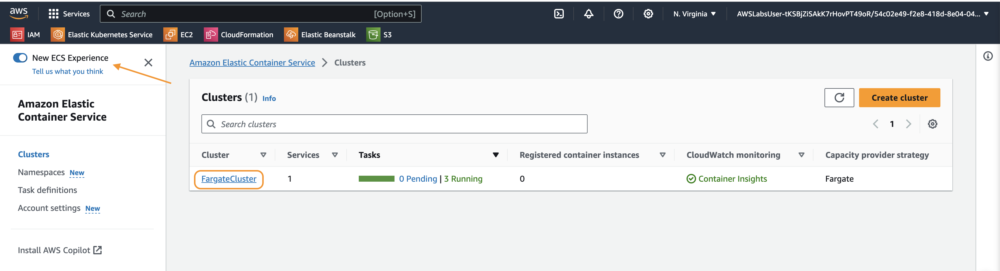
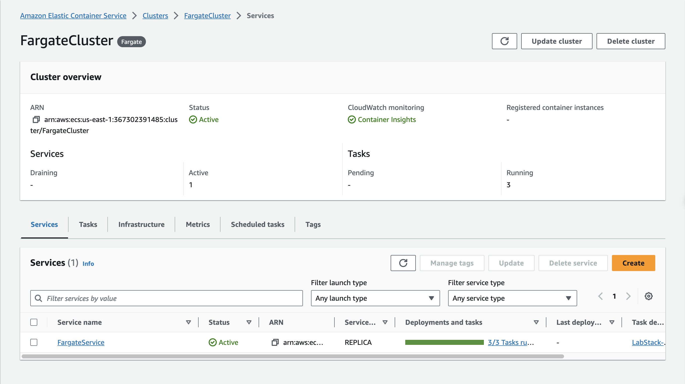
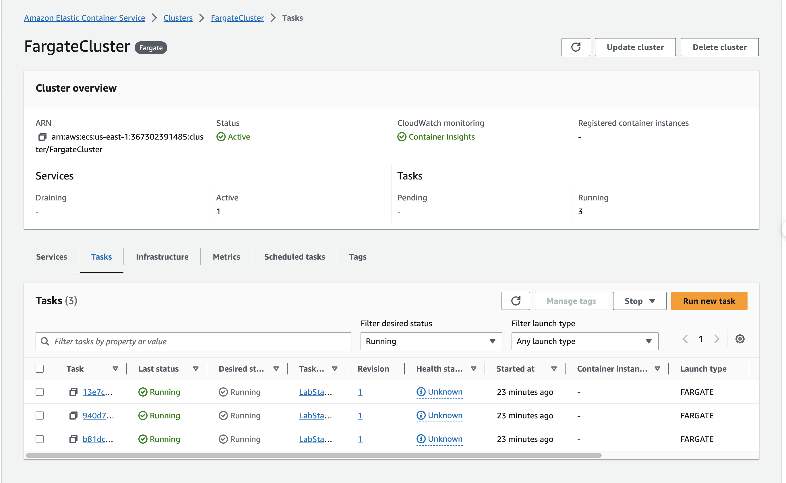

# Create a CI/CD pipeline to deploy your app to AWS Fargate

## **Lab overview**

This lab demonstrates how to build a fully managed continuous integration and continuous delivery (CI/CD) pipeline for applications that run on **Amazon Elastic Container Service (Amazon ECS)**. You use **AWS CodePipeline** to model, orchestrate, and visualize a three-stage pipeline that deploys a containerized application using a blue/green deployment strategy. This strategy launches a new version of the application that runs alongside the old version and then slowly shifts traffic to the new version. Blue/green deployments are commonly employed when performing in-place application upgrades. Administrators can use these to validate new code while simultaneously running the old application version. If errors are detected in the new code, the deployment can be rolled back quickly and reliably.

When complete, your pipeline automatically builds a new container image whenever new code is pushed to your source repository and then uses **AWS CodeDeploy** and **Amazon ECS** to manage its deployment and shift traffic to it.

In this lab, you use the following technology stack:

- AWS Cloud9
- AWS CodeBuild
- AWS CodeCommit
- AWS CodeDeploy
- AWS CodePipeline
- Amazon Elastic Container Registry (Amazon ECR)
- Amazon ECS

## **Task 1: Explore the application and review the Fargate configuration**

In this task, you connect to a basic application that displays news about **Amazon Web Services (AWS)**. The application has been deployed on **Amazon ECS** using the **AWS Fargate** launch type. After exploring the application, you review how the **Amazon ECS** cluster, service, and task definition have been configured.

Start by reviewing the application functionality.

- In the panel to the left of the instructions, find the value labeled **LoadBalancerUrl**. Copy it to your clipboard, paste it into a new browser tab, and press .
    
    Enter
    

**Note:**

- As you can see, the application pulls in a list of recent announcements related to **AWS** services. Each item in the list includes a brief summary in addition to a headline that links to a blog post that provides additional details.
- The website background is **blue**. In the subsequent tasks, you update the application source code and then build a CI/CD pipeline to deploy the change. If successful, the newly deployed application features a **green** background.
- Take a moment to scroll through the list and find an announcement that interests you. Select a headline to open the page with information about it.

Now that you’ve seen what the application does, let’s review its configuration in **Amazon ECS**.

- Return to the **AWS Management Console** browser tab.
- To open the Amazon ECS console, in the search box to the right of  **Services**, search for and choose .
    
    ECS
    

**Important** In order to complete this lab, the **New ECS Experience** must be enabled. To verify that the **New ECS Experience** is turned on in your account, do the following:

- In the upper-left corner, look for the **New ECS Experience** toggle button.
- Confirm that the button  is in the on position.



**Note:** The **Clusters** page shows that one cluster, in addition to a single service and three tasks, has been deployed in your account.

**Consider:** Understanding tasks and services is critical for anyone who wants to manage or deploy applications on **Amazon ECS**. A task consists of one or more containers and their configuration that are scheduled by **Amazon ECS**. You can create tasks independently or as part of a service. When instantiated independently, a task launches containers, which run until such time as the task is ended or the containers exit. Upon termination, no further containers are launched. By contrast, services ensure that a specified number of tasks are running at all times. Services provide administrators with granular control over task placement and scaling and can be automatically associated with a load balancer.

- Choose the **FargateCluster** link.
- Choose the **Services** tab and confirm that the **FargateService** is *Active* and displays *3/3 Tasks running*.



**Note:** *3/3 Tasks running* indicates that three replicas of the application are running concurrently in your **Amazon ECS** cluster.

- Choose the **FargateService** link.

The Status panel shows that the **FargateService** is using an **Application Load Balancer** called **FargateALB** to distribute traffic across three targets. These targets are all in a *Healthy* state and are mapped to your **Amazon ECS** tasks.

1. At the top of the screen, choose the **Deployments and events** tab.
2. Review the information in the **Deployment configuration** panel. Notice that the **Deployment type** is set to **CODE_DEPLOY**. This is a requirement for blue/green deployments launched on **Fargate**. With the **CODE_DEPLOY** deployment type, **CodeDeploy** can create a new green deployment, which runs in parallel with your existing blue deployment.
3. To return to the previous screen, in the breadcrumbs at the top of the page, choose **FargateCluster**.
4. To view the tasks that are running inside of the cluster, open the **Tasks** tab.

**Note:** Notice the three tasks, each which lists the same **task definition**. The **task definition** identifies one or more container images to run in the task in addition to various parameters, including the following:

- How much CPU and memory to use with each task or each container within a task
- The launch type to use, which determines the infrastructure that your tasks are hosted on
- The Docker networking mode to use for the containers in your task
- The **AWS Identity and Access Management (IAM)** role that your tasks use



- In the lower section of the screen, choose one of the listed tasks.

**Note:** You are brought to the **Task Configuration** page.

1. Review the information in the **Configuration** panel, paying particular attention to the **Launch type** and **Network mode**. This task is launched using the **Fargate** serverless compute engine. However, because the **awsvpc** network mode has been selected, the task has been assigned its own elastic network interface. This provides the task with the same networking properties that it would have if it were launched on an **Amazon Elastic Compute Cloud (Amazon EC2)** instance.
2. Scroll to the bottom of the page and locate the **image URI** used by the container running in the task. The URI points to an image housed in your private **Amazon ECR** repository.
- In the next steps, you navigate to your **Amazon ECR** repository and turn on **image tag immutability**.
1. In the **Amazon Elastic Container Service** panel on the left side of the screen, select **Repositories** under **Amazon ECR**.


1. One private repository appears on screen. Choose the **option button** next to the repository name, and in the **Actions**  dropdown menu, choose **Edit -> Repository**.
2. To turn on tag immutability, at the bottom of the **General settings** panel, choose the **Disabled** button .

**Security:** Turning on tag immutability improves your security posture and mitigates against image spoofing. It does this by preventing image tags from being overwritten by subsequent image pushes using the same tag.

- Scroll to the bottom of the page and choose **Save**.

**Congratulations!** Now that you understand how the **AWS News** application is configured in **Amazon ECS**, it’s time to start building your fully managed CI/CD pipeline.

## **Task 2: Configure CodeCommit as a source control repository**

In this task, you connect to an **AWS Cloud9** environment that has been pre-populated with the application source code. You then create configuration and specification files that define your pipeline and a new task definition. Lastly, you edit the source code to change the application’s background color and save everything to a **CodeCommit** repository.

- To open the **AWS Cloud9 console**, retrieve the **Cloud9Environment** link located in the panel to the left of the instructions and paste it into a new browser tab.

**AWS Cloud9** is a cloud-based integrated development environment (IDE) that you can use to write, run, and debug your code within your browser. It comes prepackaged with many tools that are commonly used in application development, including Docker, Python, and the AWS Command Line Interface (AWS CLI).

- You do not need the **Cloud9 Welcome screen** or any of the other default tabs that appear when you first launch **Cloud9**, so choose the  next to each tab to close them.
- At the top of the IDE, choose the  icon and choose **New Terminal**.
- To view the files that you will push to **AWS CodeCommit**, enter the following command:

```bash
ls ~/environment
```

**Expected output:**

```bash
Dockerfile index.js package.json routes static
```


**Note:** The following list describes files and directories in the repository that you cloned:

- **Dockerfile:** A file that lists the commands used to create the application Docker image
- **index.js:** A file that renders the application code and handles routing
- **package.json:** A file that lists metadata, dependencies, and scripts required by Node during the application build phase
- **routes:** A directory that contains a JavaScript file that makes a request to an API and fetches a list of **AWS** announcements
- **static:** A static directory that contains various files that define how content should be organized and displayed on screen

**Command:** Take a closer look at the **Dockerfile** in this directory. To view the contents of the **Dockerfile**, enter the following command:

```bash
cat Dockerfile
```

**Expected output:**

```bash
# Copyright Amazon.com, Inc. or its affiliates. All Rights Reserved.
# SPDX-License-Identifier: MIT-0
FROM public.ecr.aws/d5z8k9g9/node18-alpine3.15:latest

# Create app directory
WORKDIR /usr/src/app

# App dependencies
COPY package.json ./

# Download the dependencies listed in the package.json file and create the node_modules directory
RUN npm install

# Copy the application source code
COPY index.js .
COPY routes ./routes
COPY static ./static

# Listen on port 80
EXPOSE 80

# Start the application
CMD [ "node", "index.js" ]
```


**Note:** As you can see, this is a fairly basic Dockerfile that builds a Node.js application and exposes port 80.

However, to launch this application on **Amazon ECS** and build a pipeline that automates its deployment, you need three additional files:

- **buildspec.yaml:** **CodeBuild** uses the commands and parameters in the buildspec file to build a Docker image.
- **appspec.yaml:** **CodeDeploy** uses the appspec file to select a task definition.
- **taskdef.json** Recall that all three tasks that are currently running in your **Amazon ECS** service reference the same task definition. After updating the application source code and building a new container, you need a second task definition that points to it. The taskdef.json file is used to create this new task definition that points to your updated application image.

In the following steps, you create these files.

- **Command:** To create a buildspec file, enter the following command :

```yaml
cat << 'EOF' > ~/environment/buildspec.yaml
version: 0.2

phases:
  pre_build:
    commands:
      - echo Logging in to Amazon ECR...
      - aws --version
      - ACCOUNT_ID=$(echo $CODEBUILD_BUILD_ARN | cut -f5 -d ':') && echo "The Account ID is $ACCOUNT_ID"
      - echo "The AWS Region is $AWS_DEFAULT_REGION"
      - REPOSITORY_URI=$ACCOUNT_ID.dkr.ecr.$AWS_DEFAULT_REGION.amazonaws.com/$ACCOUNT_ID-application
      - echo "The Repository URI is $REPOSITORY_URI"
      - aws ecr get-login-password --region $AWS_DEFAULT_REGION | docker login --username AWS --password-stdin $REPOSITORY_URI
      - COMMIT_HASH=$(echo $CODEBUILD_RESOLVED_SOURCE_VERSION | cut -c 1-7)
      - IMAGE_TAG=$COMMIT_HASH
  build:
    on-failure: ABORT
    commands:
      - echo Build started on `date`
      - echo Building the Docker image...
      - docker build -t $REPOSITORY_URI:$IMAGE_TAG .
      - docker tag $REPOSITORY_URI:$IMAGE_TAG $REPOSITORY_URI:$IMAGE_TAG
  post_build:
    commands:
      - echo Build completed on `date`
      - echo Pushing the Docker image...
      - docker push $REPOSITORY_URI:$IMAGE_TAG
      - echo Writing image definitions file...
      - printf '[{"name":”myimage","imageUri":"%s"}]' $REPOSITORY_URI:$IMAGE_TAG > imagedefinitions.json
      - printf '{"ImageURI":"%s"}' $REPOSITORY_URI:$IMAGE_TAG > imageDetail.json
artifacts:
    files:
      - imagedefinitions.json
      - imageDetail.json
      - appspec.yaml
      - taskdef.json
EOF
```

**Expected output:**

*None, unless there is an error*


**Note:** The commands in the buildspec file are organized into phases: install, pre_build, build, and post_build. The artifacts section at the bottom of the file points to the location and configuration of the build output. Administrators do not need to include all phases in a buildspec file; however, the phase names should not be changed.

**Consider:** Take a moment to review the structure of the buildspec file and note the following:

- The version is set to 0.2.
- The pre_build phase is an optional phase that is used to run commands before building the application code. In this example, the pre_build phase is used to set variables that are used throughout the build process and authenticate into **Amazon ECR**. In some cases, for example , the file references pre-configured **CodeBuild** environment variables. In other cases, variables are set using shell commands.
    
    $AWS_DEFAULT_REGION
    
- Each newly built image is tagged with the corresponding  from **CodeCommit**.
    
    commit ID
    
- The commands included in the build phase are run sequentially. In this case, the  command has been included to end the build if any of the commands fail.
    
    ABORT
    
- The post_build phase pushes the Docker image produced in the build phase to **Amazon ECR**.
- Upon completion, the build produces artifacts called imageDetail.json and imagedefinitions.json, both of which are saved to the environment root directory. These files are used in the deploy phase of your pipeline and indicate which image to deploy to **Amazon ECS**.
- The artifacts section specifies that the **appspec.yaml** and **taskdef.json** files uploaded to your **CodeCommit** repository be included as build outputs. Without these files, your deployment fails.

**Note:** Because each new image is tagged with the corresponding commit ID from **CodeCommit** and **image tag immutability** has been turned on in **Amazon ECR**, you now have a fully auditable chain of custody for each image.

- **Command:** Next, to create the **appspec.yaml** file, enter the following command:

```yaml
cat << EOF > ~/environment/appspec.yaml
version: 0.0
Resources:
  - TargetService:
      Type: AWS::ECS::Service
      Properties:
        TaskDefinition: <TASK_DEFINITION>
        LoadBalancerInfo:
          ContainerName: "application"
          ContainerPort: 80
EOF
```

**Expected output:**

*None, unless there is an error*


**Note:** This file does not point to a specific task definition. Instead, the TaskDefinition label is populated with a placeholder. **CodeBuild** replaces this with your new task definition at build time. You can optionally include additional information, such as **AWS Lambda** functions that correspond to lifecycle events during your **Amazon ECS** deployment, in appspec files.

1. **Command:** Before you create your **taskdef.json** file, you need to set some environment variables. To create the variables, enter the following command:

```bash
AWS_REGION=$(curl -s http://169.254.169.254/latest/dynamic/instance-identity/document | jq -r .region)
FAMILY=$(aws ecs list-task-definition-families --status ACTIVE --output text | awk '{print $NF}')
ACCOUNT_ID=$(aws sts get-caller-identity --query Account --output text)
printf "You are using $AWS_REGION region\nYour task definition family is $FAMILY\nYour account ID is $ACCOUNT_ID\n"
```

**Expected output:**

```bash
You are using us-west-2 region
Your task definition family is xz8x1SNhwGYbcEHTLZtVKU-2-TaskDefinition-v3QkGbcSenuq
Your account ID is 111111111111
```


1. **Command:** Lastly, to create the **taskdef.json** file, enter the following command :

```bash
cat << EOF > ~/environment/taskdef.json
{
    "containerDefinitions": [
        {
            "name": "application",
            "image": "<IMAGE_NAME>",
            "portMappings": [
                {
                    "containerPort": 80,
                    "hostPort": 80,
                    "protocol": "tcp"
                }
            ],
            "essential": true,
            "logConfiguration": {
                "logDriver": "awslogs",
                "options": {
                    "awslogs-group": "cicd-logs",
                    "awslogs-region": "$AWS_REGION",
                    "awslogs-stream-prefix": "ecs"
                },
            },
        }
    ],
    "family": "$FAMILY",
    "taskRoleArn": "arn:aws:iam::$ACCOUNT_ID:role/ecsTaskExecutionRole",
    "executionRoleArn": "arn:aws:iam::$ACCOUNT_ID:role/ecsTaskExecutionRole",
    "networkMode": "awsvpc",
    "status": "ACTIVE",
    "compatibilities": [
        "EC2",
        "FARGATE"
    ],
    "requiresCompatibilities": [
        "FARGATE"
    ],
    "cpu": "256",
    "memory": "512",
    "tags": [
        {
            "key": "Name",
            "value": "GreenTaskDefinition"
        }
    ]
}
EOF
```

**Expected output:**

*None, unless there is an error*


This task definition is identical to the one that is currently running in your cluster, with one important difference—the image label is using “<IMAGE_NAME>” as a placeholder. When the pipeline is run, **CodeDeploy** updates this value with the correct image URI at deployment time. Also, the file references an **Amazon CloudWatch log group**, which must be included; otherwise, your tasks fail.

Recall that when you opened the **AWS News** application, the website background was blue. You received feedback from colleagues that the website is too dark, and they’ve asked you to change the background. You now modify the application code to make the background green. In subsequent tasks, you build a blue/green deployment that uses this modified application code in the green environment.

- **Command:** To change the application background color to green, enter the following command:

```bash
sed -i 's/282F3D/1D8102/g' ~/environment/static/css/app.css
```

**Expected output:**

*None, unless there is an error*

Now that you’ve updated the application code and created files that define your pipeline, you create a new **CodeCommit** repository and push all the files into it. Your pipeline uses this repository for source control.

- **Command:** To create a new **CodeCommit** repository and save its Secure Shell (SSH) connection URL to an environment variable, enter the following command:

```bash
export SRC_REPO_URL=$( \
    aws codecommit create-repository \
        --repository-name pipeline-source-code \
        --repository-description "Repository for AWS News application source code" \
        | jq -r '.[].cloneUrlSsh'
)
echo "Repo successfully created. Use $SRC_REPO_URL to clone the repository"
```

**Expected output:**

```bash
Repo successfully created. Use ssh://git-codecommit.us-west-2.amazonaws.com/v1/repos/pipeline-source-code to clone the repository
```


- **Command:** To update the Git configuration enter the following command:

```bash
git config --global init.defaultBranch main
```

**Expected output:**

*None, unless there is an error*

- **Command:** To initialize the **environment** directory as a local Git repository, enter the following command:

```bash
cd ~/environment
git init
```

**Expected output:**

```bash
Initialized empty Git repository in /home/ec2-user/environment/.git/
```

- **Command:** To stage your application files, commit the updated files to the local repo, and push the application code to the **main** branch in your **AWS CodeCommit** repo, enter the following commands. When asked if you would like to connect to **git-codecommit.[AWS_REGION].amazonaws.com**, enter :
    
    yes
    

```bash
git add .
git commit -m "initial commit"
git push --set-upstream $SRC_REPO_URL main
```

**Expected output:**

```bash
AWSLabsUser-vKJpDE7K1YuFQ9H2h2Riiv:~/environment (main) $ git add .
AWSLabsUser-vKJpDE7K1YuFQ9H2h2Riiv:~/environment (main) $ git commit -m "initial commit"
[main (root-commit) 306312c] initial commit
 24 files changed, 291660 insertions(+)
 create mode 100755 .DS_Store
 create mode 100644 .c9/.nakignore
 create mode 100644 .c9/Cloud9-Lab-IDE/meta.json
 create mode 100644 .c9/amazonwebservices.aws-toolkit-vscode/cloudformation.schema.json
 create mode 100644 .c9/amazonwebservices.aws-toolkit-vscode/sam.schema.json
 create mode 100644 .c9/launch.json
 create mode 100644 .c9/out_of_memory
 create mode 100644 .c9/project.settings
 create mode 100644 .c9/tasks.json
 create mode 100755 Dockerfile
 create mode 100644 appspec.yaml
 create mode 100644 buildspec.yaml
 create mode 100755 index.js
 create mode 100755 package.json
 create mode 100755 routes/news.js
 create mode 100755 static/.DS_Store
 create mode 100755 static/css/.DS_Store
 create mode 100755 static/css/amazon-ember-regular.ttf
 create mode 100755 static/css/app.css
 create mode 100755 static/img/aws-training-logo.png
 create mode 100755 static/img/favicon.ico
 create mode 100755 static/index.html
 create mode 100755 static/js/news.js
 create mode 100644 taskdef.json
AWSLabsUser-vKJpDE7K1YuFQ9H2h2Riiv:~/environment (main) $ git push --set-upstream $SRC_REPO_URL main
The authenticity of host 'git-codecommit.us-west-2.amazonaws.com (52.119.168.71)' can't be established.
RSA key fingerprint is SHA256:0pJx9SQpkbPUAHwy58UVIq0IHcyo1fwCpOOuVgcAWPo.
RSA key fingerprint is MD5:a8:68:53:e3:99:ac:6e:d7:04:7e:f7:92:95:77:a9:77.
Are you sure you want to continue connecting (yes/no)? yes
Warning: Permanently added 'git-codecommit.us-west-2.amazonaws.com,52.119.168.71' (RSA) to the list of known hosts.
Enumerating objects: 34, done.
Counting objects: 100% (34/34), done.
Delta compression using up to 2 threads
Compressing objects: 100% (29/29), done.
Writing objects: 100% (34/34), 254.96 KiB | 1.16 MiB/s, done.
Total 34 (delta 4), reused 0 (delta 0), pack-reused 0
To ssh://git-codecommit.us-west-2.amazonaws.com/v1/repos/pipeline-source-code
 * [new branch]      main -> main
branch 'main' set up to track 'ssh://git-codecommit.us-west-2.amazonaws.com/v1/repos/pipeline-source-code/main'.
```

**Congratulations!** You have successfully created a **CodeCommit** repository and uploaded the application code to it. In the following tasks, you use this repository as the source for your CI/CD pipeline.


## **Task 3: Create a CodeDeploy application and deployment group**

In this task, you prepare for your blue/green deployment by creating a **CodeDeploy** application and deployment. An application is a name that uniquely identifies the code that you want to deploy. **CodeDeploy** uses the application to ensure that the correct combination of revision, deployment configuration, instances, and Auto Scaling groups are referenced when the pipeline is invoked.

Applications work hand-in-hand with deployment groups. **CodeDeploy** uses deployment groups to specify the **Amazon ECS** service, load balancer, and target groups for your revised application code. They also include configuration details, such as how and when traffic should be rerouted to the new tasks that your pipeline creates.

- Return to the browser tab connected to the **AWS Management Console**.

**Note:** If you inadvertently closed that tab, open a new browser tab and navigate to the [AWS Management Console](https://console.aws.amazon.com/). Verify that the AWS Region displayed at the top of the screen matches the **AWSRegion** value in the panel to the left of these instructions.

- To open the **CodeDeploy** console, in the search box to the right of  **Services**, search for and choose .
- In the **Developer Tools** panel on the left side of the screen, under  **Deploy  CodeDeploy**, choose **Applications**.
- Choose **Create application**.
- On the **Create application** page, configure the following:
- For **Application name**, enter `awsnews-application`
- For **Compute platform**, choose **Amazon ECS**.
- In the lower-right area, choose **Create application**.


Now that your application has been created, it needs a deployment group.

- At the bottom of the screen, choose **Create deployment group**.
- On the **Create deployment group** page, enter the following options:
- For the **Deployment group name**, enter `awsnews-deployment-group`
- For **Service role**, choose **CodeDeployServiceRole**.
- For **Environment configuration**:
    - For **Choose an ECS cluster name**, choose **FargateCluster**.
    - For **Choose an ECS service name**, choose **FargateService**.
- For Load balancers:
    - For **Choose a load balancer**, choose **FargateALB**.
    - For **Production listener port**, choose **HTTP: 80**.
    - Test listener ports are not needed.
    - For **Target group 1 name**, choose **BlueTargetGroup**.
    - For **Target group 2 name**, choose **GreenTargetGroup**.
- For **Deployment settings**, **Traffic rerouting**, ensure that **Reroute traffic immediately** is selected.
- For **Original revision termination**, set **Days** to 0; **Hours** to 0; and **Minutes** to 5.
- Choose **Create deployment group**.

**Note:** Your deployment group adds a second target group, called **GreenTargetGroup**, to your service. Both target groups will run in parallel for 5 minutes, so you can test the new target group and roll back if necessary. At the end of the 5 minutes, the original target group will be terminated.

**Congratulations!** With your source code in CodeCommit and your CodeDeploy application and deployment group created, you’re ready to build your pipeline.


## **Task 4: Build your CI/CD pipeline**

In this task, you use **CodePipeline** to configure a pipeline that automates the release process for your application. When complete, the pipeline invokes whenever **CodeCommit** detects changes. At this point, **CodeBuild** builds a new image, pushes it to **Amazon ECR**, and then **CodeDeploy** deploys the new image to your **Amazon ECS** cluster.

- To open the **CodePipeline** console, in the search box to the right of  **Services**, search for and choose . `CodePipeline`
- Choose **Create pipeline**.

**Note:** If you see an introductory page instead of the dashboard, choose **Get Started Now**.

- For **Pipeline name**, enter `AwsNewsPipeline`
- For **Service role**, choose  **Existing service role**.
- Place your cursor in the **Role ARN** field, and in the dropdown list that appears choose, **CodePipelineServiceRole**.


- Expand **Advanced Settings**.
- For **Artifact store**, choose  **Custom location**.
- Choose the bucket with a name similar to **codepipelineartifactbucket-XXXXXXXXXXXX**.
- Choose **`Next`**.


**Consider:** In this lab, you configure **CodePipeline** to be invoked whenever new code is pushed to your **CodeCommit** repository. However, **CodePipeline** is highly versatile and can be invoked by various objects and events, including the following:

- **Branch:** **CodePipeline** monitors a branch in a **CodeCommit**, **GitHub**, or **BitBucket** repository and is invoked whenever new code is committed to it.
- **Amazon S3 object or folder:** **CodePipeline** monitors an object or folder in an S3 bucket and is invoked whenever changes are detected.
- **Amazon ECR:** **CodePipeline** monitors an image repository and is invoked whenever a new image is pushed to it.
- For **Source provider**, choose **AWS CodeCommit**.

**Note:** The menu expands so that you can configure the repository that you created as the source for your pipeline.

- Place your cursor in the **Repository name** field and in the dropdown menu that appears, choose **pipeline-source-code**.
- Place your cursor in the **Branch name** field and in the dropdown menu that appears, choose **main**.
- Keep the remaining settings unchanged and choose **Next**.


Now that you’ve configured **CodeCommit** as your pipeline source, it’s time to configure the build stage. You can configure **CodePipeline** to use either **CodeBuild** or **Jenkins** as its build provider. In this lab, you use **CodeBuild**. The build project includes information about how the build should be run, including where to find the source code, which build environment to use, which build commands to run, and where to store the build output.

- For **Build provider**, choose **AWS CodeBuild**.
- For **Region**, choose the option that matches the **AWSRegion** value shown in the panel to the left of these instructions.


- Choose **Create project**.

**Note:** A popup window appears on screen.

- For **Project name**, enter **`awsnews-build-project`**
- Scroll down the page to the **Environment** panel and enter the following values:
- For **Environment image**, choose **Managed image**.
- For **Operating system**, choose **Amazon Linux 2**.
- For **Runtimes** choose **Standard**.
- For **Image**, choose **aws/codebuild/amazonlinux2-x86_64-standard:4.0**.
- For **Image version**, ensure that **Always use the latest image for this runtime version** is selected.
- For **Environment type**, choose **Linux**.
- For **Privileged**, choose **Enable this flag if you want to build Docker images or want your builds to get elevated privileges**.
- For **Service role**, choose **Existing service role**.
- For **Role ARN**, choose **CodeBuildServiceRole**.
- Clear the **Allow AWS CodeBuild to modify this service role so it can be used with this build project** check box.


Scroll down the page to the **Logs** panel and enter the following values:

- For **Group name**, enter `cicd-logs`
- For **Stream name**, enter `codebuild`

At the bottom of the screen, choose **Continue to CodePipeline**.

**Expected output: Successfully created awsnews-build-project in CodeBuild.**

**Note:** Your build project has been successfully created and you are returned to the **CodePipeline** console.

- Choose **Next**.
- On the **Add Deploy stage** page, enter the following values:
- For **Deploy provider**, choose **Amazon ECS (Blue/Green)**.

**Note:** The Amazon ECS (Blue/Green) option is near the bottom of the dropdown menu. If it is not visible, you might need to scroll further down the list.

- For **Region**, choose the value that matches the **AWSRegion** displayed in the panel to the left of these instructions.
- For **AWS CodeDeploy application name** choose **awsnews-application**.
- For **AWS CodeDeploy deployment group** choose **awsnews-deployment-group**.
- For **Amazon ECS task definition**, in the dropdown menu, choose **BuildArtifact**. Keep the text field next to it empty.
- For **AWS CodeDeploy AppSpec file**, in the dropdown menu, choose **BuildArtifact**. Keep the text field next to it empty.
- For **Input artifact with image details**, in the dropdown menu, choose **BuildArtifact**. In the text box beneath it, enter `IMAGE_NAME`
- Choose **Next**.

The **Review** page displays the details of the pipeline that you just configured. It uses the application code in **CodeCommit** to build an image and pushes it to **Amazon ECR**. The appspec.yaml and taskdef.json files are then used to create an isolated service environment for your green deployment. **CodeDeploy** then reroutes load balancer traffic from the containers that run the blue environment to the new set of containers that run the green environment. After traffic has been successfully rerouted to the new containers, the existing containers are terminated.

It’s now time to test your pipeline. Choose **Create pipeline**.

**Expected output: Success**

**Congratulations!** You’ve successfully configured a CI/CD pipeline and initiated your first blue/green deployment. In the next task, you observe its progress.

## **Task 5: Observe a blue/green deployment**

In this task, you observe as your pipeline runs through its stages and then watch as **CodeDeploy** reroutes traffic to the new version of your application.

**Note:** Your first pipeline run is in process and should pass through the source stage quickly because it only needs to clone your repository, but the build and deploy stages take considerably longer.

- When the pipeline passes to the build phase, to view more information about the build process, in the Build panel, under  **In progress**, choose the **Details** link.

**Note:** The Details link might not appear until 15–30 seconds after the pipeline enters the build phase.

- Scroll to the bottom of the page and open the **Build logs** tab. Then choose **Tail logs**.

**Note:** It takes 1–2 minutes for **CodeBuild** to provision a new build environment. When the provisioning has completed, logs appear in the Build logs popup window.

- Wait for the build to complete and then choose **Close**.
- In the **Developer Tools** panel on the left side of the screen, under  **Deploy  CodeDeploy**, choose **Deployments**.
- The **Deployment history** panel should show one deployment in progress. To view additional details about its status, choose its **Deployment Id**.

**Note:** The deployment passes through four steps:

- **Step 1:** Amazon ECS uses the taskdef.json file to build a new task definition.
- **Step 2:** CodeDeploy reroutes traffic to the new task set.
- **Step 3:** The original tasks remain live for 5 minutes after traffic has been rerouted. During this time, you can perform testing and invoke a rollback if you detect errors.
- **Step 4:** The original task set is terminated.
- Wait for the deployment to reach **Step 3** and then return to the browser tab that contains the **AWS News** application and reload the page. Confirm that the website background is **green**, which indicates that the deployment was successful.
- Because you have confirmed that the deployment was successful, you do not need to wait the entire 5 minutes before terminating the original task set. Choose **Terminate original task set**.
- Scroll to the Deployment lifecycle events panel at the bottom of the page and confirm that the status of all events is  Succeeded.
- This is a **brand new lab** and we would really appreciate your feedback. Participation in this survey only takes **2-3 minutes** to complete. Thank you for your feedback!

**Congratulations!** You successfully built a fully managed pipeline that performs a blue/green deployment for the AWS News application.

## **Conclusion**

**Congratulations!** You now have successfully done the following:

- Configured **CodeCommit** as a source control repository for an application.
- Created a **CodeBuild** project that uses a buildspec file to build a new Docker image and saved it to **Amazon ECR** using an auditable and secure methodology.
- Created appspec.yaml and taskdef.json files that contain dynamic fields.
- Performed an in-place application upgrade using a blue/green deployment strategy configured in **CodeDeploy** and **Amazon ECS**.