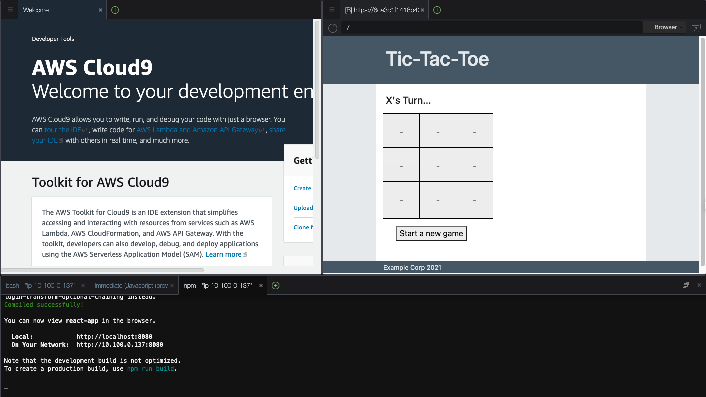

# Automate Application Testing Using AWS CodeBuild

## **Lab overview**

Incorporating automated testing into your DevOps pipelines is crucial to increase speed and efficiency by ensuring that your application functions properly after every update. Enforcing adequate test coverage will make sure that your entire application works. When you fix one area you will know if you have accidentally broken another. Finally, all of these tests are more efficient if your Developers have useful reporting to show where they need to troubleshoot any potential failures.

This lab demonstrates how you can use AWS CodeBuild as a part of your Continuous Integration pipelines to test and build your code. You will be using and writing a variety of tests that use techniques such as:

- Functional unit tests
- Isolated component tests with mocked dependencies

## **Task 1: Examine and Test the Web Application in the Development Environment**

The development team needs your help troubleshooting an application. It is a Tic-Tac-Toe game. Before you troubleshoot the build, you need to explore the application.

The team developed this game using the React JavaScript library. React is an open-source, front end, JavaScript library for building user interfaces or UI components. React can be used as a base in the development of single-page or mobile applications.

This framework creates a client-side application. All processing is handled by your web browser. Any infrastructure you use to host this application just needs to serve static data to the clients.

### TASK 1.1: INSTALL APPLICATION DEPENDENCIES AND PREVIEW THE APPLICATION

Use the AWS Cloud9 environment that was assigned to you to explore what has been built.

- On the navigation bar, enter  into the **Search** bar and press ENTER. `cloud9`
- Choose **Open** link under **Cloud9 IDE**  column.

**Note:** If you receive and error message that says it is “Unable to register Service Workers due to browser restrictions, Webviews will not work properly”, you can safely choose ok and ignore it for this lab.

- Run the following code to install npm packages.

```bash
cd ~/environment/web-application/react-app
npm install
```

One of the first things that the team learned was the importance of reproducible environments. Most modern applications depend on many open source tools and frameworks for features, build, and test tools. When you develop code for these applications, you need to be able to install these dependencies to test and build your code. Your CI/CD pipeline also installs these same dependencies to build and test the application. Package managers make managing versions of and installing these dependencies controllable. This is a crucial part of testing. In order for your tests to be accurate you need to reduce the number of variables that can cause issues. A failed test can only be caused by a change. Ensuring that your code is the only thing that changes, and not the environment saves time when troubleshooting.

Since this is a JavaScript application, there are several compatible package managers. Some of the most popular are Yarn, Bower, Jspm, and NPM. NPM is the default package manager for the JavaScript and runtime environment Node.js. That is what the team chose to use.

- Run the following command to start a local development server in your **Cloud9** environment

```bash
npm start
```

- On the **Cloud9 Menu** bar, choose **Preview**, and then choose **Preview Running Application**.

This application was created with the [create-react-app](https://github.com/facebook/create-react-app) starter pack. This comes with a set of tools that help you to develop, test, and build react projects. When you run **npm start**, it runs a script to start a local server process for you to preview the application. The page will reload if you make edits. You will also see any lint errors in the console.

You see the “Tic-Tac-Toe!” web page in the preview and you can play the game to test it. Tic-Tac-Toe, alternates moves between player X and player O, each move captures a square. The winner is determined when a player captures three squares in a row; vertically, horizontally, or diagonally.


React is a component-based, client rendered framework. This index.html page is actually displaying 4 different components rendered with JavaScript. Each component is self-contained and manages its own state, such as the current game positions. This type of design allows you to combine different components, creating a potentially complex UI.

- **App** component, highlighted in red, controls the page layout for the application.
- **PageHeader** component, highlighted in yellow, holds the game title and is a placeholder for future navigation functionality.
- **SupportInfo** component, highlighted in green, displays any Copyright information. It also contains hidden support information such as the underlying instanceID and size which operations will need.
- **GameBoard** component, highlighted in blue, displays and controls the actual game.

As you can see, the application works in the development environment. Apparently something is wrong with the game since it’s being rejected for bugs. Explore what is happening during the build.

### TASK 1.2: REVIEW THE INSTRUCTIONS USED BY AWS CODEBUILD

A buildspec is a collection of build commands and related settings, in YAML format, that CodeBuild uses to run a build.

- In the **“Cloud9 IDE”** web browser tab, in the folder tree on the left pane, under the **web-application** folder, open **buildspec.yml**.

At a high level, this buildspec file is using the same reproducible environment concept that you used earlier to make an accurate development environment. This allows you to build your application with the exact same versions of the dependencies you developed it with. If you upgrade something in your development environment, it will use the same upgraded list of dependencies in the build process.

The file starts by specifying the buildspec version. It then create a **CI** environment variable that npm will use to know that it is in a Continuous Integration environment.

The build spec has several phases that you can use to build your application, this one uses the **install** and **build** phase. CodeBuild clones your repo and starts in the root of your project folder. All of your paths will need to be referenced as if you’re in the **web-application** folder of your Cloud9 Environment.

The **install** phase sets the runtime to use version 12 of nodejs and installs all dependencies you have specified. It uses the **–silent** flag so that the size of you build logs are kept to a minimum.

The **build** phase runs commands to build the application for deployment. When you build a react application, it optimizes the files for download efficiency and web request caching.

These optimized files are placed in the **build** folder in the react project folder. The files in this **build** folder are what you need to deploy to your web server. This is what you use to create a zip file that will be published to S3. CodeBuild handles the creation of this zip file for you when you specify what artifacts you need to export.

The **artifacts** section of the buildspec file is how you specify what you want to export from the build, in this case, you want all files and folders (**/*) from the **react-app/build** folder.



## **Task 2: Automate Testing in Your Build**

The biggest issue you see is that there are no tests run during the build process. Even extremely comprehensive tests can’t detect issues if they are not run.

### TASK 2.1: INSTRUCT CODEBUILD TO USE THE TESTS WRITTEN FOR YOUR APPLICATION

The testing is already set up for use, and the command you need to add is **npm run test:ci --coverage**. This command instructs NPM to run the automated tests and monitor for coverage.

Now that you have the command, when do you run it? If the build fails, it will not allow the artifacts to be published to S3. Anywhere in the pipeline will stop the build if a test fails, but why waste the time to build your code if you don’t need to. You want to make sure that your builds complete as quickly as possible, so you want to run the test command before you run the build command.

- Add the following command as the **first** command in the list of commands in the build phase.

```bash
npm run test:ci -- --coverage
```

Critical: The test command, must have the same level of indention as the existing **- npm run build** command.

### TASK 2.2: INSTRUCT CODEBUILD TO EXPORT THE BUILD REPORTS GENERATED BY YOUR FRAMEWORK

With the change you just made, the build will only succeed if the application tests pass. The test results and failures are not as visible or easy to interpret as they can be yet. To increase visibility and clarity, CodeBuild has support to display test and coverage reports exported by your frameworks. Your test frameworks have been configured to create both types of reports that you will export.

The *reports* section of the buildspec is where you specify the report files you want to export to CodeBuild. You can export test reports and/or code coverage reports. For test reports, CodeBuild supports the following formats: Cucumber JSON, JUnit XML, NUnit XML, NUnit3 XML, TestNG XML, and Visual Studio TRX. For code coverage reports, you can use the following formats: JaCoCo XML, SimpleCov JSON, Clover XML, and Cobertura XML.

- At the end of the buildspec file, add the following reports section.

```bash
reports:
  web-application:
    files:
      - "clover.xml"
    base-directory: "react-app/coverage"
    discard-paths: yes
    file-format: CLOVERXML
  web-application-tests:
    files:
      - "junit.xml"
    base-directory: "react-app"
    discard-paths: yes
    file-format: JUNITXML
```


Critical: The reports section, must have the same level of indention as the existing **artifacts** section.

The first report exported is a coverage report included with the default packages installed with **create-react-app**. When you use the coverage property with npm test, it creates a coverage folder that contains a compatible **clover.xml** file.

The second report is the test report. This isn’t something that comes from the react initialization scripts. The team had to add the **jest-junit** package to format the output from the test results into a **JUnit** compatible report. This is why the test command uses the custom **npm run test:ci** instead of the default **npm test** during the build.

**Important**: If you have trouble editing the buildspec file, there is a complete buildspec.yml file in the **web-application\solutions** folder that you can review.

- Save the **buildspec.yml** file and close it.
- On the **Terminal** window, choose the New tab icon (), and choose **New Terminal**.
- Run the following command to confirm that the git client sees the changes made to the buildspec.yml file.

```bash
cd ~/environment/web-application
git status
```

- Run the following commands in the terminal window to commit your changes locally and push them to the shared AWS CodeCommit repository.

```bash
git add .
git commit -m "added testing to build"
git push
```


## **Task 3: Review the Build Pipeline and Analyze the Results**

Your build is using CodePipeline to automate the integration process. In this task you will see the results of adding the tests to your pipeline.

### TASK 3.1: DETERMINE WHERE YOUR BUILD IS FAILING

Go to the CodePipeline dashboard to see if the application build runs.

- In the **“Cloud9 Environments”** web browser tab, on the navigation bar, enter  into the **Search** `codepipeline`
- Choose the **web-application-pipeline**.

Wait until the pipeline finishes.

You will see that the pipeline is now failing on the **Build Stage**.

- On the **build-and-test** action, choose View in CodeBuild.
- Choose the **Phase details** tab.

The **BUILD** phase is failing with a **COMMAND_EXECUTION_ERROR**. There is an error executing the command that instructed npm to test your code in the CI environment. The developers have exported a test report to CodeBuild that you can use to view the results of the tests.

1. Choose the **Reports** tab.
2. Choose the **Report** name for the **Failed** **Test** report.

You can see from the **Summary** that two tests failed and seven tests passed. In the **Test cases** section, you see each test that was run.

1. Choose the name of the **Failed** test case, **GameBoard.test.js the game can be won by X**

This project is using [Jest](https://jestjs.io/) as the testing framework. Jest is a JavaScript Testing Framework that focuses on simplicity. It works with projects using: Babel, Typescript, Node, React, Angular Vue, and more.

Using this framework the test runner will render your components using jsdom, a lightweight browser implementation that runs inside Node.js. It renders the component being tested and then verifies that the correct output is returned. As you will see in the following steps, you can programmatically interact with the rendered components to impersonate user behavior and then confirm the results.

If the test fails, you will see the output from your testing framework on this message screen. This test is looking for a heading element that contains the text **“X is the Winner!”**. The only **heading** that it sees is **“O’s Turn…”** so the game doesn’t seem to be over. Below the **accessible roles** section, you can see the raw html output that the test framework evaluated.

The way that the game tracks the moves is by the index of the game buttons. There are three rows with three buttons each numbered 0-8. This layout is represented in the following table. According to the output, it appears that X captured the first square in each row (cells 0, 3, 6), which should have been a win for x.

|  |  |  |
| --- | --- | --- |
| 0 | 1 | 2 |
| 3 | 4 | 5 |
| 6 | 7 | 8 |

The development team used these tests at one time but must not have manually tested after a change that broke it. A code change must have broken the application but it wasn’t discovered before the code was pushed to the shared code repository. Now that running these tests have been automated with CodeBuild, any developer will know if they break the tests again.

1. Press the **X** in the top right corner of the message window.
2. Choose the name of the **Failed** test case, **PageHeader.test.js confirm that the header renders**

This test is looking for the text **“Tic-Tac-Toe!”** in the header, but the actual text in the header doesn’t have an exclamation mark on it. You will have to check with the marketing department to see which title is correct.

1. Press the **X** in the top right corner of the message window.

### TASK 3.2: RUN THE TESTS IN YOUR CLOUD9 ENVIRONMENT

You can run the same tests locally that are used during the build process thanks to the reproducible environment provided by your package manager. The command you will run in your terminal is a simplified version of the one your run in the CI environment. The one used in CodeBuild uses extra properties to run without user interaction, tests for code coverage, and creates reports.

Go back to the development environment to see if the test fails there.

1. In the **Cloud9 IDE** web browser tab, on the **Terminal** window, run the following commands.

```bash
cd ~/environment/web-application/react-app
npm test
```

By default, this only runs tests that are relevant to files changed since the last commit. There are none at this time. You need to run all tests.

1. Press a on your keyboard to run all tests.

Two tests fail and they are the same tests that fail in the pipeline.

1. In the left side folder pane, expand **web-application**, expand **react-app**, expand **src**, and open **Gameboard.test.js**.

This file instructs the test runner what to do to test your application. It starts by importing the testing libraries, **GameBoard** component, and creates a variable that is used when looping through all buttons.

The **describe** function defines a group of tests that have the same scope. It will also display the text entered, **Gameboard.test.js** in this case, in the test report so that you can easily find the tests. This **describe** function, contains multiple **test** functions for each interaction you would like to test. Each test function takes two arguments, a description, and a function to perform the test. If an error occurs anywhere in the function, the test fails.

The first test just verifies that the react component renders properly. **Line 10**, renders the component to the jsdom (the emulated browser). **Line 12**, loops through all of the buttons to make sure they have **‘-’** as the button text. **Line 14 and 15**, confirm that the reset button and game status heading have the correct starting text.

These functional tests are written to test from the user’s perspective and focus on verifying what the user should see. If you change any underlying code that may add new functionality or change how something is processed, these tests make sure that you do not break the behavior of the component that your users expect.

This testing framework also lets you impersonate user behavior, like clicking on buttons. Look at the next test, **‘the players trade moves and the outputs are correct’**. **Line 22 and 25**, render the component and confirm that the game starts by prompting for **X**’s turn. **Line 27** is where you click the button in the top left corner of the game board that is named **0**. On **line 29**, you “expect”, or verify, that the button’s text changes to **“X”** since player **“X”** just captured that square. With **line 32**, you make sure the game status heading changes to prompt **“O”** for their turn. You then click the button named **1** and confirm that **“O”** captures that square.

One of the most beneficial features of the jest test runner is that it will rerun any tests in your project every time you save code. If the npm test process is running, as it currently is in your Cloud9 environment, and you save a file in your project, it runs the tests. This is like automatically playing the game again every time you save your code to confirm that you didn’t break something!

Now that you know how these tests are written, you should be able to find the test that is failing on **Line 73**, **‘the game can be won by X’**.


The test renders the component, loops through the **game** array, and initiates a click for each item in that array. After those buttons have been clicked, it expects **X** to be the winner. If you play the game in the order defined by the array in the preview window, it appears that X should have won. This is definitely an issue with the application code that you would not want released.

- In the left side folder pane, in the **web-application\react-app\src** folder, open **Gameboard.js**.

On **line 17**, there is an array of possible winning combinations, it appears that the combination being tested, **[0,3,6]**, is not there.

- Replace the **wins** array with the following code.

```bash
wins = [
  [0, 1, 2],
  [3, 4, 5],
  [6, 7, 8],
  [1, 4, 7],
  [2, 5, 8],
  [0, 4, 8],
  [2, 4, 6],
  [0, 3, 6],
];
```

- On the Cloud9 **Menu** bar, choose **File**, and choose **Save**.

The test runner application immediately runs the tests in your terminal window. You should see that you now have only one failed test, and eight passed. You’re making progress! Now you need to fix the **PageHeader**.

You have received a message from the Marketing department and the correct title has an exclamation mark at the end, the test is correct. You need to correct your code for the test pass.

- In the left side folder pane, in the **web-application\react-app\src** folder, open **PageHeader.js**.
- Replace the title variable on **line 1** with the following.

```bash
const title = "Tic-Tac-Toe!";
```

- Save the file and confirm that all test pass.

Awesome, all tests pass now! You can commit and push your code to the shared repository.

- Press Q on your keyboard in the Cloud9 **Terminal** window to exit the test runner.
- Run the following code to commit and push your changes to AWS CodeCommit.

```bash
cd ~/environment/web-application
git add .
git commit -m "fixed the code issues discovered with automated tests"
git push
```

1. Return to the **AWS CodeBuild console**.
2. In the left navigation pane, expand  **Pipeline  CodePipeline**, and choose **Pipelines**.
3. Choose the **web-application-pipeline**.

Watch the pipeline run…


…and fail again on the **Build Stage**.

1. On the **build-and-test** action, choose View in CodeBuild.
2. Choose the **Build logs** tab.

Close to the bottom of the build log section, you can see that the build failed because of a **COMMAND_EXECUTION_ERROR**, it was an error executing the command that that instructed npm to test your code in the CI environment, again. If you roll up, you can see that all tests pass. Unfortunately, right after the table, it informs you that you aren’t testing enough of the code. The coverage threshold for lines is 100%, you’re at 95.56%.


There is a report exported for coverage that is easier to read.

1. Choose the **Reports** tab.
2. Choose the **Report** name that has **Code Coverage** in the **Type** column.

You can see from the report as well that there is not 100% line coverage.

In the **File coverage** section, it shows one file that has no coverage at all. This is where you will need to focus your work and create new tests.

## **Task: 4: Create Tests to Cover all Lines of Code**

The line coverage threshold is a configuration setting of your testing framework. The test command failed since it didn’t match the threshold configured, causing the build job to fail. Someone on the team configured this setting to align with company policy but it has apparently never been tested.

**Note:** This setting is configured in the **package.json** file for jest.

In this task you are going to create a test for the remaining file in the application. To get instant feedback on the changes you make, open the Jest test runner with the **npm test** command.

- Run the following code to start the test runner.

```bash
cd ~/environment/web-application/react-app
npm test
```

Jest looks for test files that end with **.test.js**. You will create your new test file in the src directory following the naming convention that was established by the existing tests.

- In the left side folder pane, in the **web-application\react-app** folder right click (context click) on the **src** folder and select **New File**.
- For the new file name enter: `App.test.js`

The test runner application immediately runs the new test in your application. It will fail since there are no test cases in the new file yet.

- Open **App.test.js** and paste the following code into it and save the file.

```bash
import { render, screen } from "@testing-library/react";
import App from "./App";

describe("App.test.js", () => {
  test("renders App component", () => {
    render(<App />);
  });
});
```

That will cause the test runner to run your test and it will pass. This test just renders the App component. This works, and would actually give you 100% test coverage, but the scope of this test is too broad.

Since App.js renders sub-components, you want to make sure that a failure in one of those doesn’t cause the parent test to fail. To handle this we will mock the sub-components. With the introduction of mocking, we are able to just do component testing and not integration testing. If the interaction between components is important, you can always create another test file that doesn’t use mocking.

Take a look at the **App.js** file so that you can see how it works. This will help you to know what you need to mock.

1. In the left side folder pane, in the **web-application\react-app\src** folder, open **App.js**.

At the top of this window you will notice that, other than a style sheet, 3 files are imported to render the sub-components. You will need to mock all 3 of these functions so that a failure in one of them doesn’t cause a failure in this parent component. This will make your test results more accurate and much easier to locate the cause of a failure.

1. In the **App.test.js** file, after **line 4**, paste the following code.

```bash
jest.mock("./GameBoard", () => {
  return function GameBoard(props) {
    return <div data-testid="GameBoard">Gameboard</div>;
  };
});
jest.mock("./SupportInfo", () => {
  return function SupportInfo(props) {
    return <div data-testid="SupportInfo">SupportInfo</div>;
  };
});
jest.mock("./PageHeader", () => {
  return function PageHeader(props) {
    return <div data-testid="PageHeader">PageHeader</div>;
  };
});
```


The **jest.mock** will essentially intercept the calls to import those 3 modules and return the simple function included in the mock call instead of the contents of the requested files. For instance, instead of the test rendering the entire GameBoard, it only renders a div component with the text GameBoard in it.

1. Save the file to test your App component, the test should still pass.
2. In the **Terminal** window, press Q on your keyboard to exit the test runner.
3. Commit and push your code to the shared repository which will initiate your build.

```bash
cd ~/environment/web-application
git add .
git commit -m "added missing tests and to achieve 100% coverage."
git push
```

1. On the **“CodeBuild - AWS Developer Tools”** web browser tab, in the navigation pane, choose **Build history** under  **Build  CodeBuild**

If you don’t already see another build **In progress** or **Succeeded**, press the  button.

1. Choose the name of the latest **Build run** in progress to view the output.

Your build should finally succeed! View the reports to confirm your new tests and 100% code coverage.

1. Above the log output, Choose the **Reports** tab.

The Test report should have a **Status** of **Succeeded**.

1. Choose the **Report** name for the report that has **Test** in the **Type**.

You can see that all of the tests are showing in this report.

1. Choose the **back** button on your web browser.
2. Choose the **Report** name to view the **Code coverage** report.

You now have 100% code coverage so that any change to your application will catch an unexpected user outcome.

## **Optional Challenge: Write tests for all possible winning conditions**

Currently, the application tests for one winning condition with X and one winning condition with O. As shown earlier in this lab, the game will still appear to work correctly even though it is not testing for all possible Tic-Tac-Toe winning conditions. As mentioned earlier in this lab, Tic-Tac-Toe only has eight possible winning combinations in the array that you fixed earlier.

As a challenge, add additional tests to the **Gameboard.test.js** file to test all possible winning conditions. As you create your tests, you can remove a winning condition from the array in the **Gameboard.js** file to confirm that the test really would catch an issue. You can review how the two existing combinations that are tested on **lines 73 to 79** and **lines 81 to 87**. You can use this as a template to help write the new tests.

If you would like to see one potential solution, you can open the **Gameboard.test.js** file in the **web-application/solutions** folder and compare it to your **Gameboard.test.js**. The choice was made to use individual tests in this solution so that if a test fails it is immediately apparent which winning condition is the issue.

---

## **Conclusion**

Congratulations! You now have an automated build pipeline for your web application code. The pipeline not only publishes the application bundle to be deployed, it only publishes it if your code works as expected.

You can successfully:

- Configure CodeBuild to perform application testing
- Troubleshoot and fix CI/CD pipeline failures
- Review CodeBuild reports and logs
- Apply common code testing strategies
- Describe the importance of robust test coverage